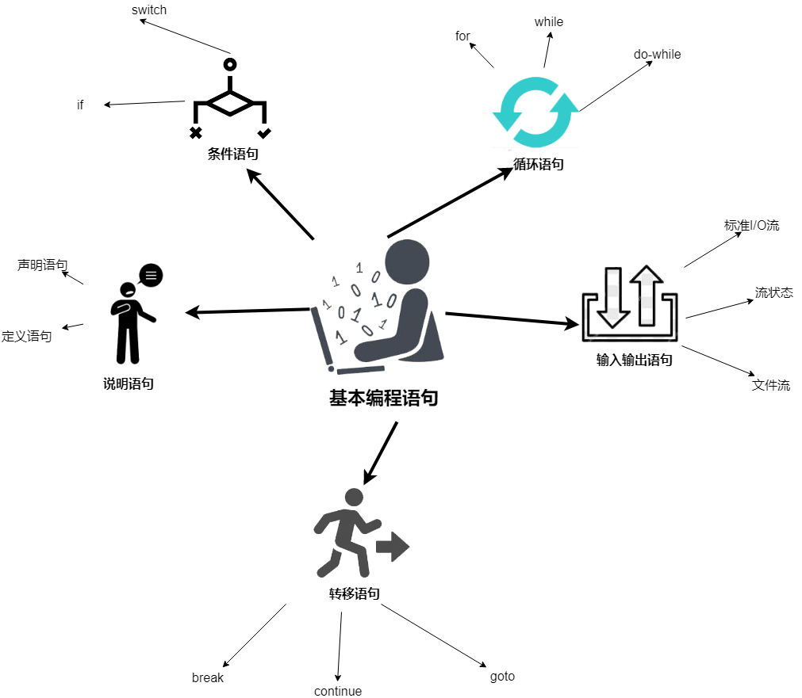
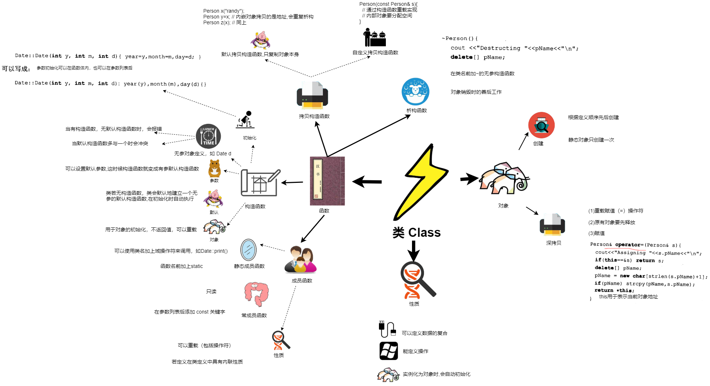

## 目录
  * <a href="./第1章/">概述</a>
  * <a href="./chapter_2/README.md">基本编程语句</a>
  * <a href="./chapter_7/README.md">程序结构</a>
  * <a href="./chapter_3/README.md">数据类型</a>
  * <a href="./chapter_5/README.md">函数机制</a>
  * <a href="./chapter_8/README.md">类和对象生灭</a>

  
  
  
  
