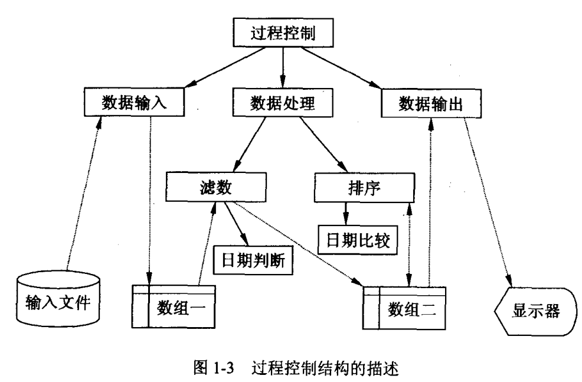

# </img>第1章概述 Introduction

## 1.1 程序设计语言 Programming Language
程序设计语言是：
  * 人类与计算机 ***交流*** 的工具：将需要解决的 ***问题***，用"语言翻译"加工以使计算机理解其描述。

机器语言：
  * 用0和1来表示
  * 难写难读
  * 是低级语言

汇编语言：
  * 机器语言的直接符号表示
  * 抽象性好
  * 基本上是低级语言

## 1.2 C++前史
略

## 1.3 C++

### 1.3.1 褒贬 C (Comment on C)
:thumbsup: 优点：
  * 高度灵巧
  * 实现高效
  * 简捷
:-1: 缺点：
  * 语言简陋
  * 设计方法贫乏

### 1.3.2 C继承者 (Inheritor of C)

C++ 是一种混合型程序设计语言，“混合” 体现在可以采用不同的程序设计方法。

C++对C的继承是 ***青出于蓝而胜于蓝*** ：
  * 过程化编程 (包容C)
  * 基于对象编程
  * 面向对象编程 (继承和多态)
  * 泛型编程

### 标准C++ （Standard C++）
  * 为编译软件开发创造了前提条件
  * 解决语言设计者、程序员和用户之间的沟通问题
  * 有了共同遵循的准则，编写的程序更有效，更通用，更易懂
  * 产品有更高的系统可移值性;
  * 提高了程序质量
  * 促进交流，提高软件竞争力

## 1.4 C++ 编程流程 (C++ Programming Flow)

### 1.4.1 编程过程 (Programming Procedure)

程序要翻译成机器代码，翻译类型有：
  * 解释型：边读程序边翻译，翻译成机器代码后就执行
    * 没有编译和链接
    * 运行时不能脱离开发环境
    * 低性能
  * 编译型：先全部翻译成机器代码，保存在可执行程序文件中，然后启动该程序执行
    * 高性能
    * 运行时脱离开发环境

一般的编程操作流程：编辑 (edit) .cpp —— 编译 (compile) .obj—— 链接 (link) .exe —— 调试 (debug)


### 1.4.2 最小样例程序 (Minimum Sample Program)

```
#include<iostream>
int main()
{
  std::cout<<"hello world!";
}
```
程序中 iostream 是 C++ 标准输入/输出流类的标准库头文件。

#include 指示编译器，在编译之前先将括号中的文件内容在本程序中原地展开。

C++程序的 ***入口点*** 总是 int main(), main 表示一个过程或者函数的名字，在C++中，过程和函数可以看作是同一个概念。 int 表示整数 (integer) ，表示 main 返回一个整型数。

std 是“名空间”。就好像A班有张三，B班也有张三，使用名空间（班级）可以避免名冲突。

### 1.4.3 程序网络 (Programming Style)
  * 可读性为准则
  * 合理的紧凑
  * 模块整体性
  * 对齐
  * 锯齿型嵌套
  * 有效的注释

## 1.5 程序与算法 (Programs & Algorithms)

### 1.5.1 程序 (Programs)
  * 静态：
    * 某种语言编制出来的一定形式的 ***动作序列***
    * 表达了人的系统性 ***思维***
  * 动态：
    * 是逐一执行的操作

### 1.5.2 算法 (Algorithms)

算法： 是 ***求解*** 特定 ***问题*** 的一组 ***有限*** 的 ***操作*** 序列

算法特性：
  * 目的性：算法是有求解目的之动作序列，因此，算法必须有运算 ***结果***。而程序只是强调过程性。
  * 抽象性：算法可以用任意 ***伪语言*** 来描述
  * 研究性：更多用于理论研究，描述算法的目的是 ***沟通*** 人们的思想。

### 1.5.3 编程与结构 (Programming & Structures)

编程是为了解决计算问题，计算问题强调算法，程序设计也就是在数据描述方式上的算法设计。

程序 = 算法 + 数据结构

算法事实上与数据相分离，数据由数据结构来描述，算法以数据结构为依托，通过数据结构来访问数据，从而简化算法和提高逻辑清晰性。

## 1.6 过程化程序设计 (Procedural Programming)

### 1.6.1 基于过程的程序设计 (Procedure-Based Programming)

将 ***复杂过程*** 简单地按 ***功能分层*** 从而达到解决问题的目的，这种思想就是过程化程序设计思想。

无法重复使用 “零部件”，而且问题变得庞大以后，其复杂性会无法收场。

例 1-1 有一些日期数据，放在数据文件 abc.txt 中， 这些日期的年、月、日数值加起来若等于15，则收集，然后按日期从小到大的顺序打印出来。

整个问题写成算法是：
  * 第一层（总体结构）
    * 1.1 输入（读入文件的数据放入数组一）
    * 1.2 处理（读入数组一的数据，处理后放入数组二）
    * 1.3 输出（读入数组二的数据，输出到显示器上）
  * 第二层（处理）
    * 2.1 滤数（读入数组一，收集符合条件的放入数组二）
    * 2.2 排序（对数组二的数据进行排序）

画成图的形式如图 1-3 所示。

图中 ***实线*** 箭头表示 ***过程控制*** 关系，或称 ***过程调用*** 。 ***虚线*** 箭头表示数据流向， ***矩形框*** 表示过程。



### 1.6.2 结构化程序设计 (Structured Programming)


