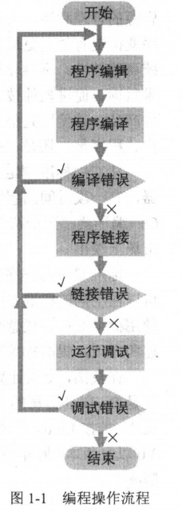

# </img>第1章概述 Introduction

## 1.1 程序设计语言 Programming Language
程序设计语言是：
  * 人类与计算机 ***交流*** 的工具：将需要解决的 ***问题***，用"语言翻译"加工以使计算机理解其描述。

机器语言：
  * 用0和1来表示
  * 难写难读
  * 是低级语言

汇编语言：
  * 机器语言的直接符号表示
  * 抽象性好
  * 基本上是低级语言

## 1.2 C++前史
略

## 1.3 C++

### 1.3.1 褒贬 C (Comment on C)
:thumbsup: 优点：
  * 高度灵巧
  * 实现高效
  * 简捷
:-1: 缺点：
  * 语言简陋
  * 设计方法贫乏

### 1.3.2 C继承者 (Inheritor of C)

C++ 是一种混合型程序设计语言，“混合” 体现在可以采用不同的程序设计方法。

C++对C的继承是 ***青出于蓝而胜于蓝*** ：
  * 过程化编程 (包容C)
  * 基于对象编程
  * 面向对象编程 (继承和多态)
  * 泛型编程

### 标准C++ （Standard C++）
  * 为编译软件开发创造了前提条件
  * 解决语言设计者、程序员和用户之间的沟通问题
  * 有了共同遵循的准则，编写的程序更有效，更通用，更易懂
  * 产品有更高的系统可移值性;
  * 提高了程序质量
  * 促进交流，提高软件竞争力

## 1.4 C++ 编程流程 (C++ Programming Flow)

### 1.4.1 编程过程 (Programming Procedure)

程序要翻译成机器代码，翻译类型有：
  * 解释型：边读程序边翻译，翻译成机器代码后就执行
    * 没有编译和链接
    * 运行时不能脱离开发环境
    * 低性能
  * 编译型：先全部翻译成机器代码，保存在可执行程序文件中，然后启动该程序执行
    * 高性能
    * 运行时脱离开发环境

一般的编程操作流程：编辑 (edit) .cpp —— 编译 (compile) .obj—— 链接 (link) .exe —— 调试 (debug)

### 1.4.2 最小样例程序 (Minimum Sample Program)

