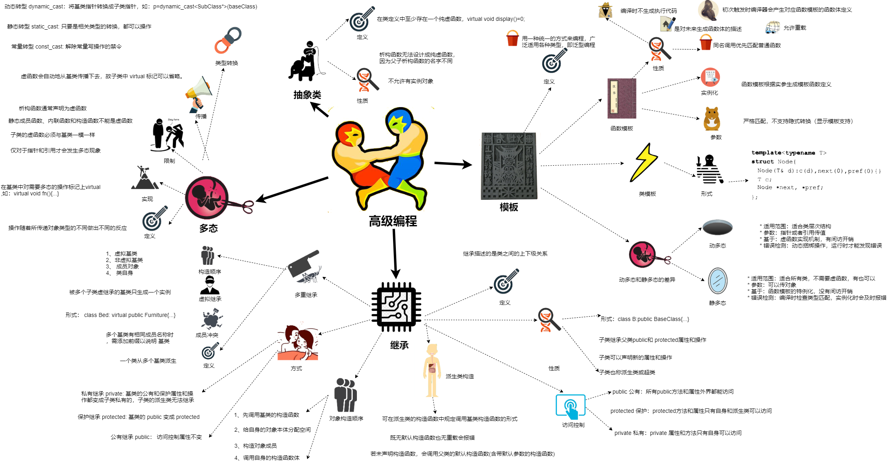

# 高级编程

## 第10章 继承 (Inheritance)

继承：类之间的上下级关系

继承：
  * 子类继承父类public和 protected属性和操作
  * 子类可以声明新的属性和操作。
  * 子类也称派生类或超类，它有更多的数据和操作

派生类继承的方式是： class B:public BaseClass{...};

访问控制：
  * public 公有：所有public方法和属性外界都能访问
  * protected 保护：protected方法和属性只有自身和派生类可以访问
  * private 私有：private 属性和方法只有自身可以访问

派生类构造：
  * 若未声明构造函数，会调用父类的默认构造函数(含带默认参数的构造函数)
  * 既无默认构造函数也无重载会报错
  * 可在派生类的构造函数中规定调用基类构造函数的形式

对象构造顺序：
  * 先调用基类的构造函数
  * 接下来给自身的对象本体分配空间
  * 构造对象成员 （若有多个对象，按声明顺序）
  * 调用自身的构造函数体

继承方式：
  * 公有继承 public： 访问控制属性不变
  * 保护继承 protected: 基类的 public 变成 protected
  * 私有继承 private: 基类的公有和保护属性和操作都变成子类私有的，子类的派生类无法继承

多重继承
  * 一个类从多个基类派生

基类成员名冲突
  * 多个基类有相同成员名称
  * 需要在相同成员名称前添加前缀以说明基类

虚拟继承：
  * 形式： class Bed: virtual public Furniture{...}
  * 被多个子类虚继承的基类只生成一个实例

多继承的构造函数被调用顺序:
  * 虚拟基类
  * 非虚拟基类
  * 成员对象
  * 类自身

## 第12章 多态 (Polymorphism)

多态
  * 定义：操作随着所传递对象类型的不同做出不同的反应
  * 实现：在基类中对需要多态的操作标记上virtual,如：virtual void fn(){...}
  * 限制：
    * 仅对于指针和引用才会发生多态现象
    * 子类的虚函数必须与基类一模一样
    * 静态成员函数、内联函数和构造函数不能是虚函数
    * 析构函数通常声明为虚函数
  * 传播：虚函数会自动地从基类传播下去，故子类中 virtual 标记可以省略。
  * 类型转换：
    * 动态转型 dynamic_cast：将基类指针转换成子类指针，如：p=dynamic_cast<SubClass*>(baseClass)
    * 静态转型 static_cast: 只要是相关类型的转换，都可以操作
    * 常量转型 const_cast: 解除常量写操作的禁令

## 第13章 抽象类 (Abstract class)

抽象类:
  * 定义：在类定义中至少存在一个纯虚函数，virtual void display()=0;
  * 不允许有实例对象
  * 析构函数无法设计成纯虚函数，因为父子析构函数的名字不同。

手柄类：
  * 目的：专门用于处理有多态表现指针的释放

## 第14章 模板 (Templates)

模板机制基于万事万物都具有相似性

模板编程: 用一种统一的方式来编程，广泛适用各种类型，即泛型编程

函数模板:
  * 性质：
      * 编译时不生成执行代码
      * 是对未来生成函数体的描述
      * 初次触发时编译器会产生对应函数模板的函数体定义
      * 同名调用优先匹配普通函数
      * 允许重载
  * 实例化：函数模板根据实参生成模板函数定义
  * 参数：
    * 严格匹配，不支持隐式转换（显示模板支持）

类模板：
  * 类定义
  * 成员函数定义
  * 参数：
    * 类型参数：确定类型
    * 值参数：传递值
    * 默认实参
  * 实例化
    * 根据具体的模板实参，实例化类模板的定义部分

模板的多态：
  * 定义： 编译时进行静态识别，也称静多态
  * 不需要虚函数，传递什么类型，就表现什么类型的操作

动静多态的差异：
  * 动多态：
    * 适用范围：适合类层次结构
    * 参数：指针或者引用传值
    * 基于：虚函数实现机制，有间访开销
    * 错误检测：动态捆绑操作，运行时才能发现错误
  * 静多态：
    * 适用范围：适合所有类，不需要虚函数，有也可以
    * 参数：可以传对象
    * 基于：函数模板的特例化，没有间访开销
    * 错误检测：编译时检查类型匹配，实例化时会及时报错

