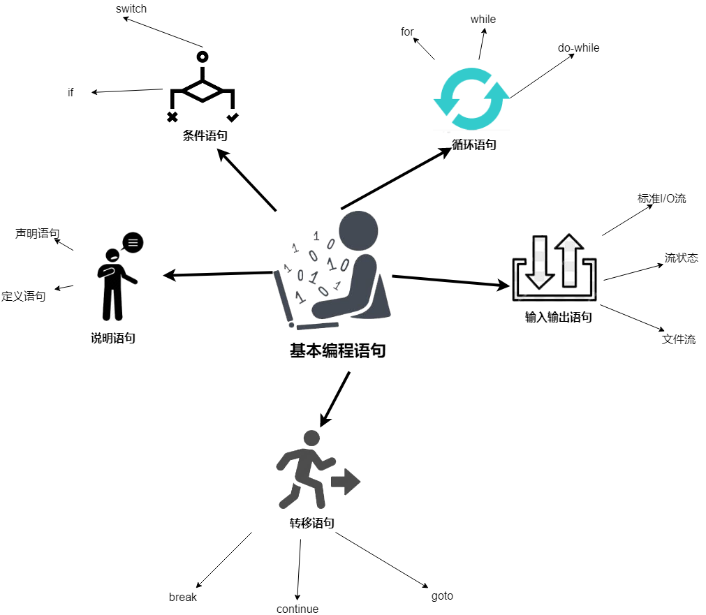

# 第二章 基本编程语句 (Basic Programming Statements)



## 2.1 说明语句 (Declarative Statements)
  * 定义语句
    * 声明了名称
    * 分配存储空间
  * 声明语句
    * 声明了某个名称

## 2.2 条件语句 (Conditional Statements)

分支语句：
  * if
  * switch

### 2.2.1 if 语句 (if Statement)

### 2.2.3 switch 语句 (switch Statement)

```
switch(表达式) {
  case 常量表达式1:语句1
  case 常量表达式2:语句2
  // ...
  default: 语句 n+1
}
```

switch括号中的表达式类型：
  * 整型
  * 字符型
  * 枚举型

因为 case 语句起语句标号作用，所以 case 与 default 并 ***不改变*** 控制流程。

case 只有与 break 语句联用，才能实现 ***分支控制***。

每个 case 分支都带有 break 的情况下，case 次序不影响执行结果。

## 2.3 循环语句 (Loop Statements)

2.3.1 for 循环结构 (for Loop Structure)

```
int sum=0;
  for (int i=1;i<=100;i++){
    sum+=i;
  }
  cout<<sum<<endl;
```


2.3.3 while 循环 (while Loop)

```
int sum=0,i=1;
  while (i<=100)
  {
    sum+=i++;
  }
  cout<<sum<<endl;
```

### 2.3.4 do-while 循环 (do-while Loop)

先执行一次，再判断是否继续执行

```
int sum=0,i=1;
  do{
    sum+=i++;
  }while(i<=100);
  cout<<sum<<endl;
```

## 循环设计 (Loop Designs)

1. 画出以下图形


```
for (int i=1;i<=10;i++){
  输出第i行
  换行
}

for(int i=1;i<=10;i++){
    for(int j=1;j<=i;j++){
      cout<<"M";
    }
    cout<<endl;

    //cout<<setw(i)<<setfill('M')<<""<<endl;
  }
```


```
for(int i=1;i<=10;i++){
  输出若干空格
  输出若干M
  换行
}

for(int i=1;i<=10;i++){
    // 输出若干空格 i-1
    for(int j=1;j<=i-1;j++){
      cout<<" ";
    }
    // 输出若干M  (10-i)*2+1
    for(int k=1;k<=(10-i)*2+1;k++){
      cout<<"M";
    }
    // 换行
    cout<<endl;

    // 第二种方法
    // cout<<setfill(' ')<<setw(i-1)<<""<<setfill('M')<<setw(21-2*i)<<""<<endl;
  }
```


```
for(int i=1;i<=10;i++){
    // 输出若干空格 10-i
    // 输出字符 2i-1
    // 换行
  }

for(int i=1;i<=10;i++){
    // 输出若干空格 10-i
    for(int j=1;j<=10-i;j++){
      cout<<" ";
    }
    // 输出字符 2i-1
    // for(int k=1;k<=2*i-1;k++){
    //   cout<<char('A'+k-1);
    // }
    for(int ch='A';ch<='A'+2*i-1;ch++){
      cout<<char(ch);
    }
    // 换行
    cout<<endl;
  }
```


```
for(int i=1;i<=7;i++){
    // 空格变化为 y=|x-4|
    // * 变化为 y=2*(-|x-4|+4)-1
    cout<<setfill(' ')<<setw(abs(i-4))<<""
      <<setfill('*')<<setw(2*(-abs(i-4)+4)-1)<<""<<endl;
  }
```

### 2.4.2 素数判定 (Prime Decision)

假定某个整数不是素数，则一定可以表示成两个因子的积：

m=i*j 假定 i<=j

则 i² ≤ m ≤ j²

所以只要试除到m的平方根就行了。

```
int main(){
  cout<<"Please input a number:\n";
  int m;
  cin>>m;
  double sqrtm=sqrt(m*1.0);
  for(int i=2;i<=sqrtm;i++){
    if (m%i==0){
      cout<<m<<" not prime";
      return 1;
    }
  }
  cout<<m<<" prime\n";
}
```

## 2.5 输入输出语句 （I/0 Statements）

### 2.5.1 标准I/O流 (Standard I/O Stream)

### 2.5.2 流状态 (Stream States)

流 iostream 主管数据类型的 ***识别*** 和 ***沟通*** 操作系统


#### 有参常用的三个流状态

cout.width(5);  // 设置显示宽度

cout.fill('S'); // 设置填充字符

cout.precision(3); //设置有效位数

#### 与<<联用的方式

setw(int)

setfill(char)

setprecision(int)

cout<<setw(6)<<setfill('$')<<27<<endl;

使用时，要包含头文件 iomanip


### 文件流 (File Streams)

文件有两种：
  * 文本文件
  * 二进制文件

文件打开格式：

  ifstream fin(filename, openmode=ios::in);

  ofstream fout(filename, openmode=ios::out);

ifstream 和 ofstream 是类型名，openmode是打开方式，ifstream 的默认打开方式是ios::in，表示输入。

```
// 定义变量，这种形式类似 int a(1) ,等价于 int a=1;
  ifstream in ("a.in"); // 读入文件
  ofstream out ("a.out"); // 输出文件
  for (string str;getline(in,str);){
    out<<str<<endl;
  }
```

## 2.6 转移语句 (Move Statements)


### 2.6.1 break 语句 (break Statement)

break 语句用在 for、while、do-while和 switch语句中。

break 语句只是跳出当前循环。

### 2.6.2 continue 语句 (continue Statement)

continue 语句用在循环语句中，作为结束本次循环。

### 2.6.3 goto 语句

goto 语句是低级语言的表征，很灵活，灵活到不受任何拘束。

在C++中只有一个地方不觉有使用goto的价值：当从多重循环深处直接跳转到最外围循环之外时。

```
for (int i=10;i<=20;i++){
    for(int j=1;j<=100;j++){
      if(i*j==150) goto End;
    }
  }
  End:
  cout<<"end";
```

## 2.7 再做循环设计 (More Loop Designs)

