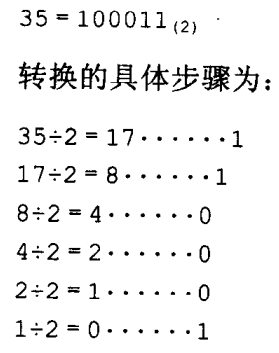
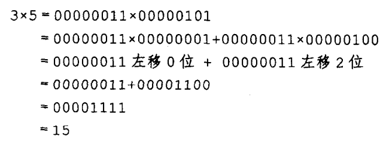
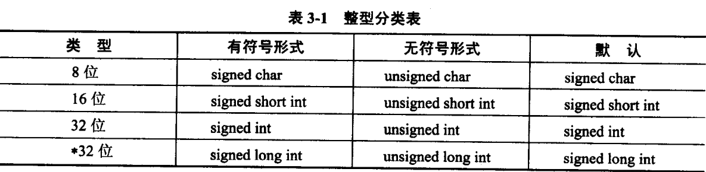
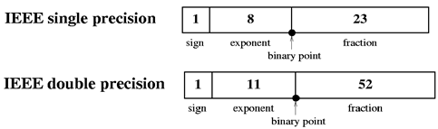
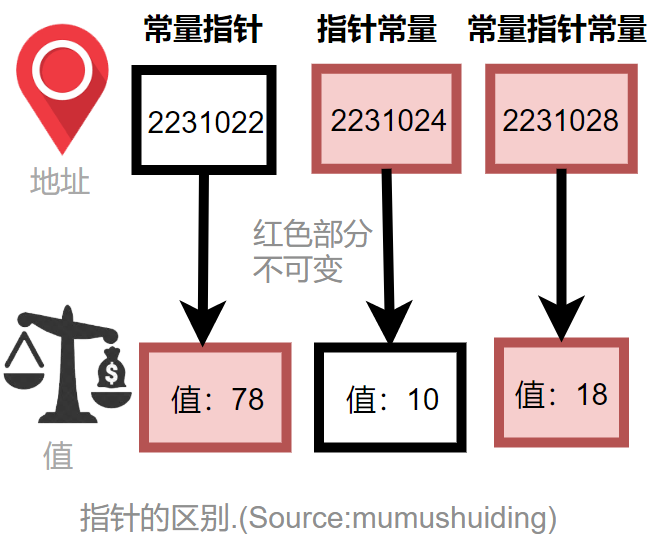

# 第三章 数据类型 (Data Types)


## 3.1 整型 (int Types)

整型定义了：
  * 整数的表示形式
  * 整数的运算（操作）
  * 表示范围

### 3.1.1 二进制补码 (Binary Complement)

计算机语言在计算机内部都是以 ***二进制补码*** 形式表示整数的原因：
  * 高度一致性
  * 统一了加减法的意义
  * 简化了乘除法运算
  * 简化了硬件结构

转换方式采用 ***除2取余法***， 如：



由于字节单位是定长的，位数不足时高位补0

十进制负数使用二进制补码形式的整数时，规则是 ***取反加一*** ，如 ***8位*** 长度的二进制表示：

                          -15 = -1111₍₂₎

                              = -00001111

                              = 11110001

二进制整数左移一位相当于乘2运算，二进制补码的乘法都分解成了一系列左移和加法操作，例如：

  

除法：
  将除数进行左移，判断余数是否小于除数，小于则结束：

        13 ÷ 3 = 1101 ÷ 0011

  除数为 0011，左移2次，余数为1，小于除数，所以：

        13 ÷ 3 = 1101 ÷ 0011 = (1100 + 0001) ÷ 0011 

                            = 0100 余 0001

                            = 4

### 3.1.2 整型数表示范围 (int Range)




32位编译器整数范围：
   * char: 字节数 1，位数 8
   * short int 字节数 2，位数 16
   * int 字节数 4 , 位数 32
   * long 字节数 4， 位数 32

## 3.2 整数子类 (int Subtypes)

### 3.2.1 字符型 （char Type）
  * 普通字符
  * 控制字符
  * 转义字符 (escape character)

char 可以作为整数的子集，例如：

    char a = 31;

    int b = a + '\a';

char 与整数的区别在输出上，char输出字符，整数输出数字。

### 3.2.2 枚举型 (enum Type)

枚举型是对整数 ***区间*** 的自定义类型，如：

  enum Week { Mon, Tue, Wed}

默认第一个对应整数0，后面递增1，也可人为规定，如：

  enum Color { Red=5, Green, Yellow, Blue=20, Orange}

则 Green 对应整数为6， Orange 对应21.

### 3.2.3 布尔型 (bool Type)

整数 1和0两个值构成了 bool型的表示范围。相当于:

enum bool { false, true };

任何非0整数给bool型变量赋值时，其值都为1，如:

    bool a=3; //  a 为true

    bool b=1; // b 为 true

    bool c = a-b; // 为false （不是3-1，而是1-1）

## 3.3 浮点型 (float Type)

### 3.3.1 浮点数表示 (Floating-Point Number Representation)

浮点数： 小数点位置可以左右浮动

有效值：非0数字序列

尾数： 小数部分，随着小数点位置变化而变化

范围：单精度浮点数，阶码有8位，范围约等于 ±2¹²⁸，或约等于±3.4×10³⁸



十进制转二进制：
  * 整数部分：采用 ***除2取余法***
  * 小数部分：采用 ***乘2取整法*** ，小数乘以2
    * 取其整数部分
    * 取其小数部分再乘以2
    * 循环以上两步，直到小数为0或者取到足够位数

## 3.4 C-串与string (C-strings & string)

### 3.4.1 C-strings

C-strings:
  * 一个全 ***0*** 位字节作为结束符的字符串
  * 还称为 ASCIIZ串，即ASCII字符加上尾巴Zero
  * char buffer[7]="Hello!"; // 若为 char buffer[6]="Hello!";则错误

### 3.4.2 字符指针与字符数组

### 3.4.3 string

### 3.4.5 string 流 (string Streams)

## 3.5 数组 (Arrays)

格式：类型名 数组名[常量表达式]; 

常量表达式：值是整数及其子集。

## 3.6 向量 (Vectors)

vector 是向量类型，它是一种对象实体

vector 四种定义方式：
  * vector<int> a(10); // 定义了10个整数元素的向量，未初始化
  * vector<int> b(10,1);// 定义了10个整数元素向量，初始值为1
  * vector<int> c(b); // 使用另一个向量来创建
  * vector<int> d(b.begin(), b.begin()+3); // 值为b向量中的第0到第2个元素

## 3.7 指针与引用 (Pointers & References)

### 3.7.1 指针 (Pointers)

指针定义形式：* 可以居左、居右、居中

int iCount=18;

int* ip=&iCount; 

“&” 表示获取实体的地址

float f =34.5

int* ip=&f // 错: float地址不能赋给int指针 

int* ip=123456;// error: 不能进行 int 到 int*的直接转换

int* sp=reinterpret_cast<int*>(123456); // ok

数组名本身就是表示元素类型的地址

int arr[6];

int* ip=arr


指针的增减是以该类型的实体大小为单位的。

### 3.7.4 指针限定 (Pointers Restrictions)

指针的常量性：
  * 指针常量 (constant pointer): 指向的地址值不能修改的指针
  * 常量指针 (pointer to constant): 指向常量的指针，指向的常量值不能修改



```
  const int a=78;
  int b=10;
  int c=18;

  const int* ip=&a; // const 修饰指向的实体类型-常量指针（pointer to constant）
  int* const cp=&b; // const 修饰指针*cp - 指针常量（constant pointer）
  int const* dp=&b; // 指针常量

  *ip=87; // 错： 常量指针不能修改指向的常量
  ip=&c; // ok: 常量指针可以修改指针值
  *cp=81; // ok: 指针常量可以修改指向的实体
  cp=&b; // 错： 指针常量不能修改指针值。
```


### 3.7.5 引用 (Reference)

从逻辑上理解，引用是个别名(alias)

引用是个隐性指针

引用定义是必须初始化

int someInt=5

int& rInt=someInt;