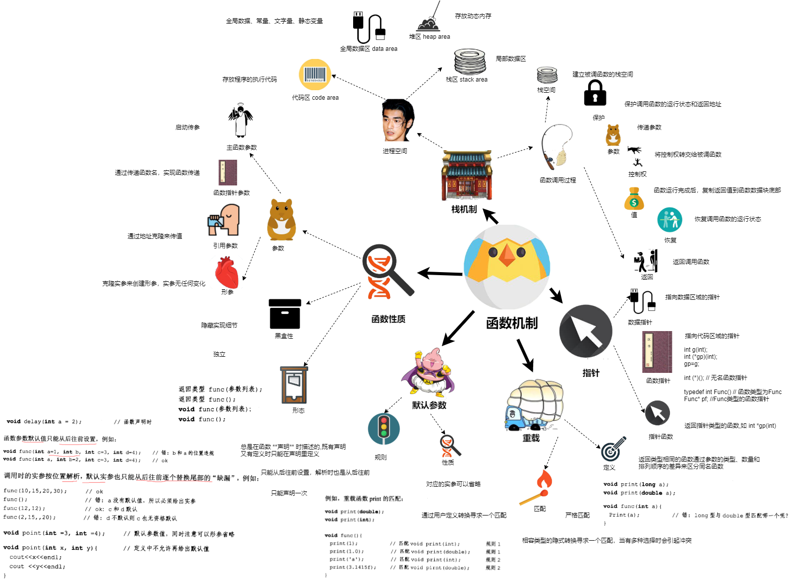

# 第5章 函数机制 Function Mechanism



##  函数性质

函数形态：
  * 返回类型 func(参数列表);
  * 返回类型 func();
  * void func(参数列表);
  * void func();

函数黑盒性：
  * 函数是独立的：函数只对输入和输出负责，计算封闭在黑盒中进行。
  * 隐藏实现细节

参数：
  * 形参：克隆实参来创建形参，实参无任何变化
  * 引用参数： 通过地址克隆来传值
  * 函数指针参数： 通过传递函数名，实现函数传递
  * main函数参数
    * 结构：int main(int argc, char** argv){...}
    * argc 表示传递的C-串有几个
    * argv 表示C-串数组
## 栈机制

进程空间：
  * 代码区 code area:存放程序的执行代码
  * 全局数据区 data area 存放:
    * 全局数据
    * 常量
    * 文字量
    * 静态变量
  * 堆区 heap area: 存放动态内存
  * 栈区 stack area: 局部数据区

函数调用过程：压栈和退栈操作
  * 建立被调函数的 **栈空间**
  * **保护** 调用函数的运行状态和返回地址
  * 传递 **参数**
  * 将 **控制权** 转交给被调函数
  * 函数运行完成后，复制 **返回值** 到函数数据块底部
  * **恢复** 调用函数的运行状态
  * **返回** 调用函数

## 函数指针（Function Pointers）

指针：
  * 数据指针 Pointer to Data: 指向数据区域的指针
  * 函数指针 Pointer to Function 或 Function pointer: 指向代码区域的指针,如：int (*gp)(int);
    * 定义：
      ```
      int g(int);
      int (*gp)(int);
      gp=g;

      int (*)(); // 无名函数指针

      typedef int Func() // 函数类型为Func
      Func* pf; //Func类型的函数指针
      ```
  * 指针函数 Pointer Function: 返回指针类型的函数,如 int *gp(int);

## 函数重载（Function Overload）

定义： 返回类型相同的函数通过参数的类型、数量和排列顺序的差异来区分同名函数

匹配：
  * 严格匹配
  * 相容类型的隐式转换寻求一个匹配，当有多种选择时会引起冲突
  * 通过用户定义转换寻求一个匹配

## 默认参数 (Default Parameters)

性质：
  * 对应的实参可以省略

规则：
  * 总是在函数 **声明** 时描述的,既有声明又有定义时只能在声明里定义
  * 只能从后往前设置，解析时也是从后往前
  * 只能声明一次