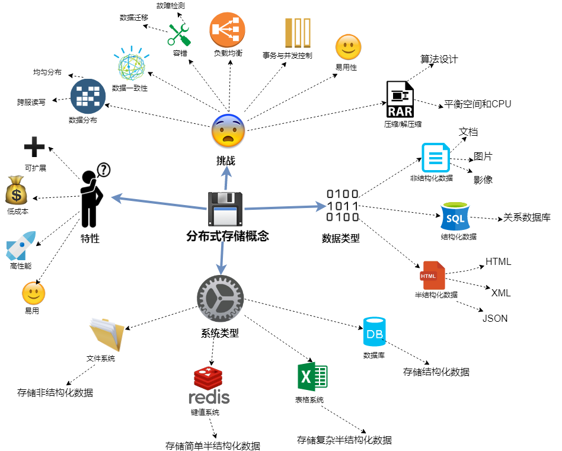

# 大规模分布式存储系统架构概述

## 概念
大规模分布式存储系统的 ***定义***：“分布式存储系统是大量普通 ***PC*** 服务器通过 ***Internet*** 互联，对外作为一个 ***整体*** 提供存储服务”。

分布式存储系统具有如下几个 ***特性***：
  * :balloon: ***可扩展*** 。可以扩展到几百台甚至几千台的集群规模。
  * :moneybag: ***低成本***。
  * :rocket: ***高性能***。
  *  ***易用***。

分布式存储系统的挑战：
  * 数据 ***分布*** ：如何 ***均匀*** 分布？如何 ***跨服*** 读写
  * 一致性。
  * 容错：如何故障检测？如何故障之后数据迁移？
  * 负载均衡：如何自动负载均衡？
  * 事务与并发控制：如何实现分布式事务？如何实现多版本并发控制？
  * 易用性
  * 压缩/解压缩：如何设计压缩算法？如何平衡算法节省的存储空间和消耗的CPU资源？

## 分布式存储分类 
  
分布式存储面临的数据类型：
  * 非结构化数据：包括办公文档、文本、图片、图像、音频和视频信息等。
  * 结构化数据： 一般存储在关系数据库中，可以用二维关系表结构来表示。
  * 半结构化数据：一般是自描述文件，如JSON、HTML、XML等

分布式存储系统类型：
  * 分布式文件系统
    * 主要存储非结构化数据
    * 数据一般称为Blob
  * 分布式键值系统
    * 存储关系 ***简单*** 的半结构化数据
    * 一般用作缓存
    * 支持简单的CRUD操作
  * 分布式表格系统
    * 存储关系 ***复杂*** 的半结构化数据
    * 支持简单的CRUD操作和扫描某个主键范围
  * 分布式数据库
    * 存储结构化数据
    * 支持SQL关系查询语言