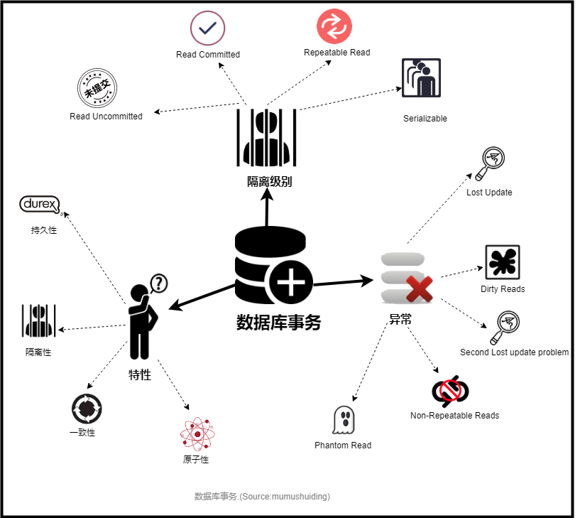
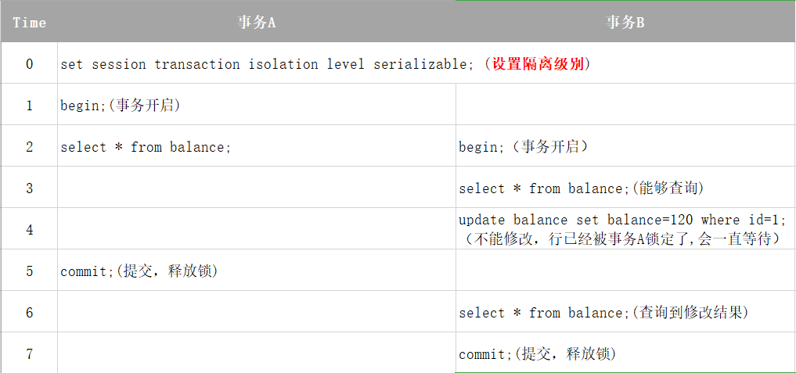
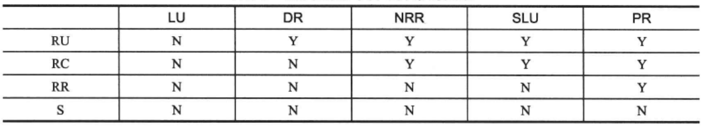

## 数据库事务

### 数据库事务特性
  * ***原子性***（Atomicity）：体现在事务对数据的 ***修改***， 即要么全都执行，要么全都不执行。
  * ***一致性***（Consistency）：事务执行的结果必须是使数据库从一个一致性状态变到另一个一致性状态。
  * ***隔离性***（Isolation）：执行多个事务时，数据库要保证每一个事务在它的修改全部完成之前，对其它事务是 ***不可见*** 的。
  * ***持久性***（Durability）：事务完成后，它对于数据库的影响是永久性的，即使系统出现各种异常也是如此。

### 事务的隔离级别：

#### Read Uncommitted（RU）

读取 ***未提交*** 的数据，即其他事务已经修改但还未提交的数据，这是最低的隔离级别，可能导致的问题是 ***脏读***。

#### Read Committed（RC）

读取 ***已提交*** 的数据。一个事务只能看见已经提交事务所做的修改。可能导致的问题是 ***不可重复读*** 。

#### Repeatable Read（RR）

可 ***重复*** 读取，确保同一个事务的多个实例在并发读取数据时，会看到同样的数据行，除非提交了该事务，再次进行读取。可能导致的问题是 ***幻读*** 。

#### Serializable （可序列化）

最高的隔离级别，通过强制事务排序，使之不可能相互冲突。该隔离级别可能导致大量的超时现象和锁竞争。

### 事务执行异常：

#### Lost Update 第一类更新丢失

A事务撤销时，把已经提交的B事务的更新数据覆盖了。

#### Dirty Reads（DR） 脏读

一个事务会讲到另一个事务更新后但未提交的数据，如果另一个事务 ***回滚*** ，那么当前事务读到的就是脏数据。

#### Non-Repeatable Reads（NRR）不可重复读

不可重复读是指，在一个事务内，多次读同一个数据，在这个事务还没有结束时，如果另一个事务恰好修改了这个数据，那么，两次读取的数据可能不一致。

#### Second Lost Updates problem（SLU）第二类更新丢失

两个并发事务同时读取和修改同一数据项，则后面的修改可能使得前面的修改失效。A事务覆盖B事务已经提交的数据，造成B事务所做操作丢失.

#### Phantom Read 幻读

幻读是指，在一个事务中，第一次查询某条记录，发现没有，但是，当试图更新这条不存在的记录时，竟然能成功，并且，再一次读取同一条纪录，它就神奇地出现了。

### 隔离级别和读写异常的关系

