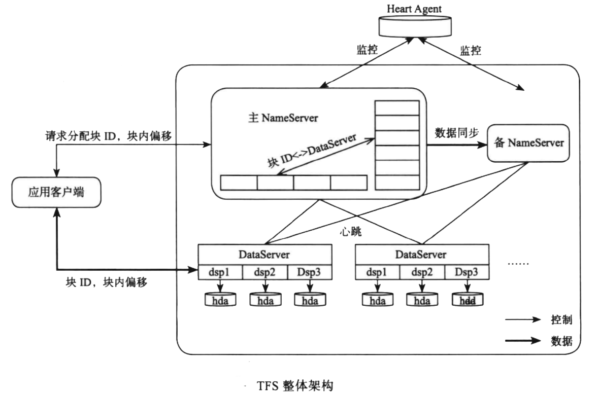
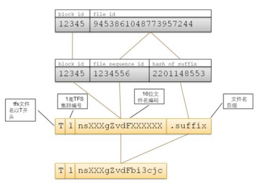
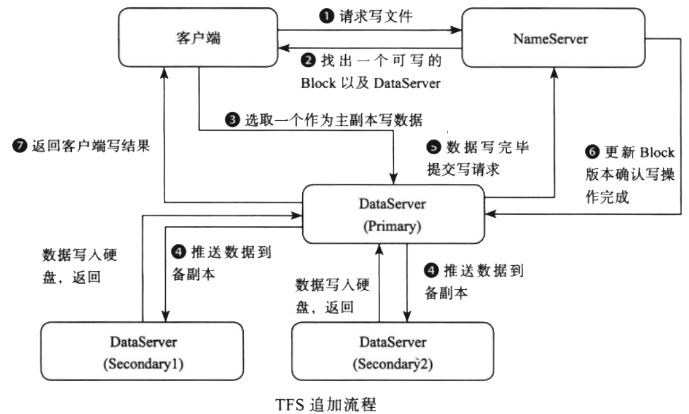
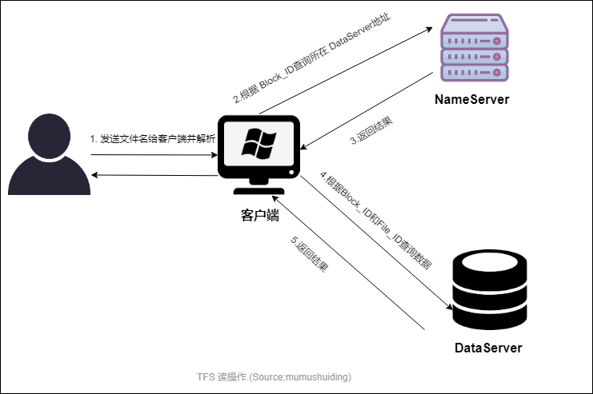

# 淘宝文件系统TFS

## 系统架构

### NameServer

#### Block管理

在TFS中，将大量的小文件合并成一个大文件，这个大文件称为块Block，每个Block拥有在集群唯一的编号（块ID）,通过<块ID,块内偏移>可以确定一个文件，默认存储三份。Block 大小可以通过配置来决定，通常为64M.

每个Block在文件系统上以“主块和扩展块”的方式存储，每个Block可能会有多个实际的物理文件组成：一个主 Phsical Block文件，N个扩展Physical Block文件和一个与该Block对应的索引 文件。

TFS的文件名由块号和文件号通过某种对应关系组成，最大长度为18字节。文件名固定以T开始，第二字节为该集群的编号(可以在配置项中指定，取值范围 1~9)。余下的字节由Block ID和File ID通过一定的编码方式得到。文件名由客户端程序进行编码和解码，它映射方式如下图：

TFS客户端在读文件的时候通过将文件名转换为BlockID和FileID信息，然后可以在NameServer取得该块所在DataServer信息（如果客户端有缓存，则从缓存中取），然后与DataServer进行读取操作。
#### DataServer管理

DataServer加入及退出，以及监听DataServer的心跳

#### 管理Block与所在DataServer之间的映射关系

NameServer 需要维护Block信息列表，以及Block与DataServer之间的映射关系，元素数据结构如下：

### DataServer

每个DataServer上会运行多个 dsp 进程，一个 dsp 对应一个挂载点，每个挂载点对应一个独立磁盘。

#### DataServer 后台线程

* ***心跳线程*** ：负责keepalive
* ***复制线程*** 
* ***压缩线程*** 
* ***检查线程*** 
  * 清理过期的Datafile
  * 清理过期的复制块
  * 清理过期的压缩块
  * 每天rotate读写日志，清理过期的错误逻辑块
  * 读日志累积后刷磁盘

### Client 客户端

TFS提供给应用程序的访问接口，客户端不缓存文件数据，只缓存NameServer的元数据。

## 流程

### 追加流程
  * 1) 请求写操作
  * 2) 根据DataServer上的可写块、容量和负载加权平均来选择一个可写的Block。
  * 3) 并且在该Block所在的多个DataServer中选择一个作为主副本，并写入数据。
  * 4) 推送数据到备副本。
  * 5) 如何所有副本修改成功，主副本会通知NameServer更新Block的版本号。
  * 6) 更新版本确认
  * 7) 返回客户端写结果。写结果返回两个信息，小文件在TFS中的Block编号（Block id） 以及 Block 偏移（Block offset）。应用系统会将这些信息保存到数据库中。

  

### 读流程
  * 1) 客户端解析文件名Filename
  * 2) 根据Block ID 查询所在 DataServer地址
  * 3) 返回DataServer地址
  * 4) 发送Block ID和File ID 查询数据
  * 5) 返回查询结果

  

## 容错机制

  * 集群容错，TFS可以配置主辅集群，主集群提供所有功能，辅集群只提供读。
  * NameServer 采用了HA结构，一主一备。
  * DataServer 容错，TFS采用Block存储多份的方式来实现DataServer容错。