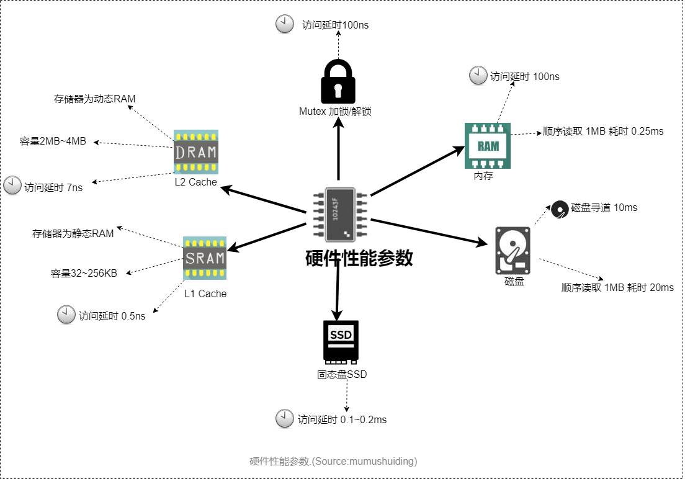

# 常见硬件的性能参数

L1 Cache：是 ***CPU*** 第一层高速缓存，属于 ***静态RAM***，分为 ***数据*** 缓存和 ***指令*** 缓存。***容量*** 通常在32-256KB. ***访问延时*** 0.5ns.

L2 Cache：是 ***CPU*** 第二层高速缓存，属于 ***动态RAM***， ***容量*** 通常在2MB-4MB.***访问延时*** 7ns.

Mutex 加锁/解锁：***访问延时*** 100ns.

内存：***访问延时*** 100ns，顺序读取 ***1MB*** 数据耗时 0.25ms

SATA 磁盘：***磁盘寻道*** 10ms, 顺序读取 ***1MB*** 数据耗时20ms

固态盘 SSD： ***访问延时*** 0.1~0.2ms.
