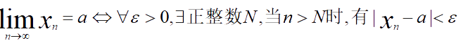
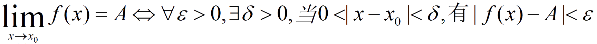

## 极限

### 数列的极限

定义 设 {xₙ} 为一数列，如果存在常数 a, 对于 ***任意*** 给定的正数 ε ， 总 ***存在*** 正整数 N ，使得 n > N 时，不等式：

        |xₙ - a| < ε

都成立，那么就称常数 a 是数列 {xₙ} 的极限。

定义可表达为：

收敛： 数列有极限

发散： 数列没有极限。

#### 收敛数列的性质

定理一（极限的唯一性） 如果数列 {xₙ} 收敛，那么它的极限唯一。

定理二（收敛数列的有界性）如果数列 {xₙ} 收敛，那么 {xₙ} 一定有界。

定理三（收敛数列的保号性）极限a>0 (或a<0)，则∃正整数N, 当 n>N 时， xₙ>0 (或xₙ<0>)。

定理皿（收收敛数列与其子数列间的关系）如果数列{xₙ}收敛于a,那么它的任一子数列也收敛，极限也是a

### 函数的极限

定义1  设函数f(x)在点x₀的某一 ***去心邻域*** 内在定义。如存在常数A,对任一正数ε，总存在正数δ，使得当 0<|x-x₀|<δ时，

    |f(x)-A|<ε

那么常数 A 就叫 f(x) 当 x→x₀ 时的极限。

